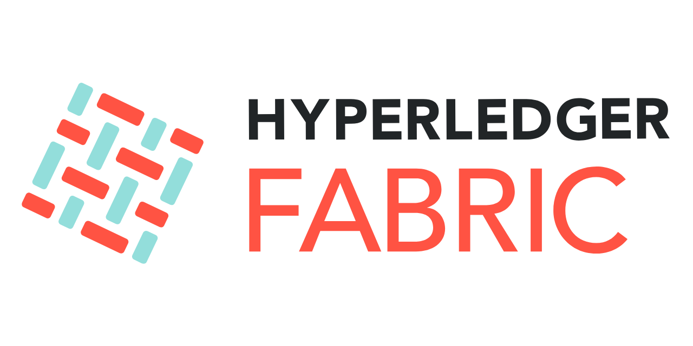

### Hi there 👋
I am Tuan Nguyen, a full-stack software developer, with 8+ years in startup and product companies with vast IT experience. Skills include creative problem-solving, self motivated and analytical thinking.

When technology’s moving too fast, I believe “speed” and “changes” are keys to success. That’s why I always try to learn faster and enjoy collaborating with others to gain different perspectives to refine strategies.

- 🔭 I’m currently working on ...
- 🌱 I’m currently learning blockchain and Devops
- 👯 I’m looking to collaborate on a blockchain team or a blockchain company
- 💬 Ask me about ...
- 📫 How to reach me: ...

**Currently working with:**  

**Previously worked with:**

**Learning:**

<!--https://profile-counter.glitch.me/tuan072090/count.svg-->

|  |  |
| ------------- | ------------- |
