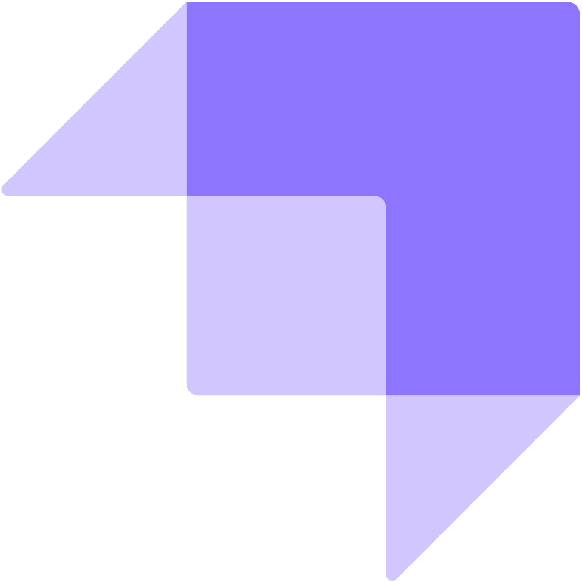

### Hi there 👋
I am Tuan Nguyen, a full-stack engineer, with 8+ years in product and startup companies with vast IT experience. Skills include creative problem-solving, self motivated and analytical thinking.

- 🌱 I’m currently learning blockchain and Devops
- 👯 I’m looking to collaborate on a blockchain team or a blockchain company
- 📫 How to reach me: 
  -   <a href="https://telegram.me/tuan072090">telegram.me/tuan072090</a>
  -   <a href="mailto:tuannmuit@gmail.com">tuannmuit@gmail.com</a>

**Currently working with:**  

**Previously worked with:**

**Learning:**

 
📈 My github stats

<!--https://profile-counter.glitch.me/tuan072090/count.svg-->

|  |  |
| ------------- | ------------- |
